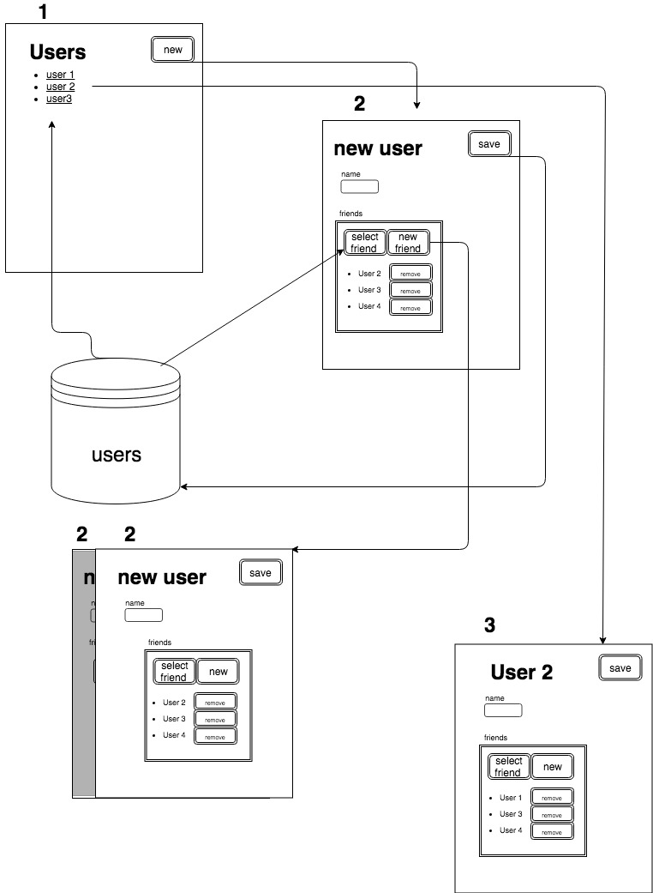

# React assessment

## Goals of the assessment

Evaluate the implementation of concepts related to component-based architectures, testing, and frontend related knowledge in general.

## Requirements

Build a React application that allows creating users with name and friends (friends are also users) with the following:

- A page that lists all users and links to a user detail page and to a "create user" page (1 in the schema)
- A page to create a new user (2 in the schema)

  - in this page, a user must insert a name
  - a friend can optionally be selected by users already existing
  - if "new friend" is clicked a new "create user" page is stacked on top of the current one while showing a slice of the previous
    NB: this can we done infinitely - when two or more creation are stacked clicking on a lower item in the stack asks the user to save or abort the current user creation

- A page that allows edit of a user (3 in the schema)

## constrains

- a user creation or user update can randomly fail.
- if creation fails, try again without the user knowing
- if creation fails two times in a row inform the user that something went wrong and show a button that allows for a retry
- cannot have two or more users with the same name

## Bonus point (optional)

consider these ONLY after the logic is already working

- Use TypeScript
- Style the UI to be pleasant according to your taste
- Use a css-in-js solution to do the styling such as [emotion](https://emotion.sh/)

## Faq

Q: Should I create a server for the API?  
A: No, an in-memory implementation is enough

Q: Is the visual styling relevant for this test  
A: No

Q: Should it work on mobile?  
A: This is unimportant

Q: Can I use an existing component library? (material-ui, reactstrap etc)  
A: No, it creates too much unnecessary clutter, defeating the purpose of this test.

Q: Can I use library XXX or framework YYY ?  
A: Use anything you think is most appropriate for the usecase

Q: What should I test and how should I test it?  
A: This decision is open to the developer.

## Why this test

The application is small but with some challenging details that allow a candidate to choose how to solve them.

### What is being tested

- software design given constrains
- component compositions and reuse
- usage of patterns and best practices
- knowledge of tooling around the Frontend ecosystem
- attention to details in specification documents
- making tech choices autonomously
- software testing, what is tested and how

## Time requirements

This assessment is meant to test how a candidate works in a work-like day-to-day situation, a tight deadline (days) is highly discouraged.
